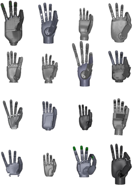

  

<h1 align="center">somehand</h1>

  Universal dexterous-hand retargeting with MediaPipe, MuJoCo, and YAML-configured robot hands.
   
  Use live tracking or recorded motion to visualize, simulate, or control a supported hand.

  <a href="docs/en/README.md">English documentation</a> •
  <a href="docs/zh/README.md">中文文档</a>

somehand provides a command-line tool for complete tracking workflows and a small Python API for embedding retargeting in another application. Inputs include webcam, video, PICO Bridge, hc_mocap UDP, and saved recordings. Robot models and retargeting constraints are selected with YAML configs; large runtime assets are downloaded separately.

Start with [Installation](docs/en/getting-started/installation.md) or [安装](docs/zh/getting-started/installation.md), then choose the [CLI tutorial](docs/en/tutorials/cli.md) or [Python API tutorial](docs/en/tutorials/api.md).

## License

[Apache 2.0](LICENSE)
